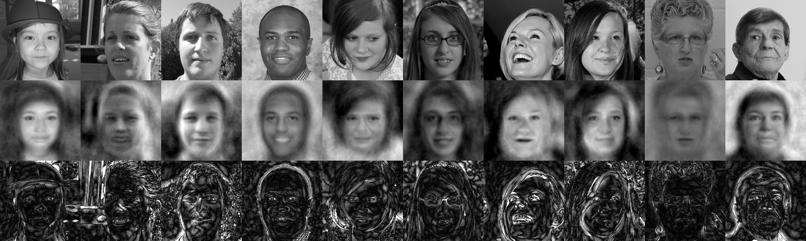

# FaceRecognition.jl

FaceRecognition.jl is a Julia package for PCA face recognition.



## Installation

First, download and install Julia. Then clone the repository:

```bash
git clone https://github.com/ethanmorris99/FaceRecognition.jl.git
```

## Usage
cd to the directory containing the repo and launch the Julia REPL, and enter the following code to generate an example image:

```julia
include("example.jl")

image_dir = "./data/images/"   # The directory where the images are stored
n = 1000                       # Use first 1000 images as training data
d = 50                         # Reduce to 50 dimensions
test_range = 1001:1010         # Use 1001th to 1010th images as test data
filename = "example"           # Name for generated image

generate_example(image_dir, n, d, test_range, filename=filename)

```
The example will show the original images, the images reconstructed from eigenfaces, and the absolute pixel differences between the originals and the reconstructions.


## License
[MIT](https://choosealicense.com/licenses/mit/)
