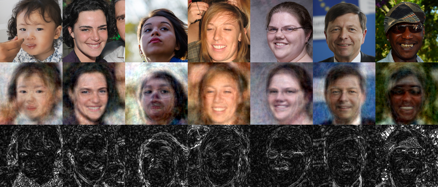

# FaceRecognition.jl

FaceRecognition.jl is a Julia package for PCA face recognition.



## Installation

First, download and install Julia. Then clone the repository:

```bash
git clone https://github.com/ethanmorris99/FaceRecognition.jl.git
```

## Usage

cd to the directory containing the repo and launch the Julia REPL, and enter the following code to generate an example image:

```julia
include("example.jl")

image_dir = "./data/images/"   # The directory where the images are stored
n = 1000                       # Use first 1000 images as training data
d = 50                         # Reduce to 50 dimensions
test_range = 1001:1010         # Use 1001th to 1010th images as test data
filename = "01"           # Name for generated image

model = get_model(image_dir, n, d)
generate_example(model, test_range, filename=filename)
morph_faces(model, image_dir, test_range, 10, filename=filename)
```

generate_example() will create an image with the test faces, the test faces reconstructed from eigenfaces, and the absolute pixel differences between the test faces and their reconstructions.

morph_faces() will create a gif morphing between each face in the test range.


## License

[MIT](https://choosealicense.com/licenses/mit/)
